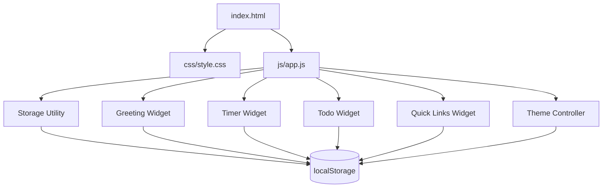
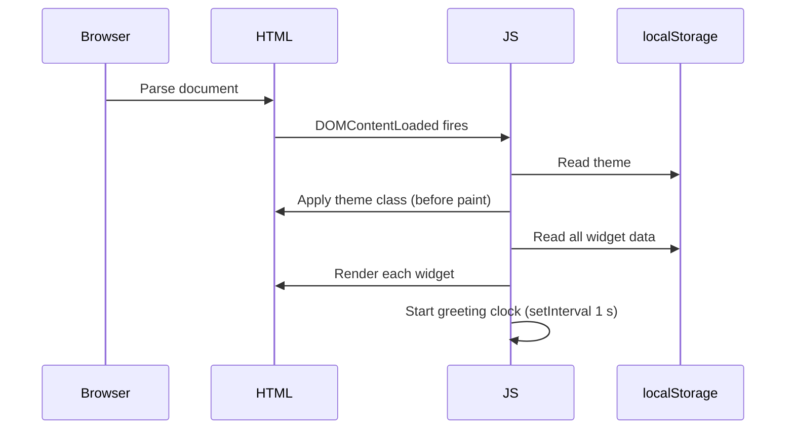
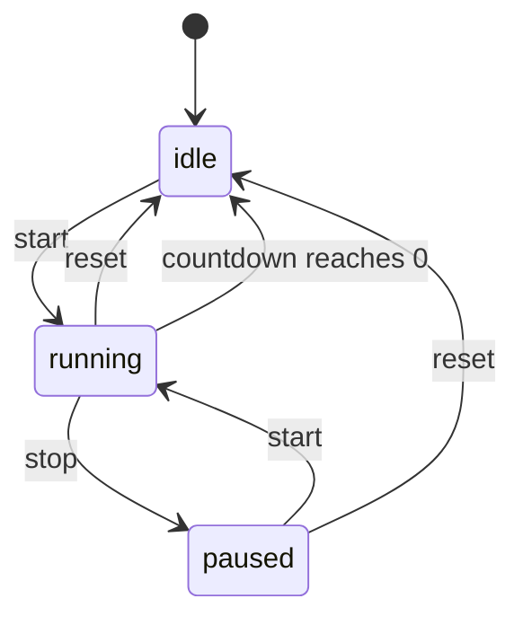

# Design Document: Personal Dashboard

## Overview

A single-page personal dashboard built with plain HTML, CSS, and Vanilla JavaScript. It runs entirely in the browser with no build step, no backend, and no external dependencies. All state is persisted via `localStorage`. The app is structured as three files:

```
index.html
css/style.css
js/app.js
```

The dashboard renders five widgets: a greeting (time/date/name), a Pomodoro focus timer, a to-do list, a quick links panel, and a theme toggle. On load the app reads `localStorage`, applies the saved theme before paint to avoid flash, then initialises each widget with its stored data.

---

## Architecture

The app follows a simple module pattern inside a single `app.js` file. There is no framework, no virtual DOM, and no reactive state library. Each widget is a self-contained object with `init()`, `render()`, and `save()` methods. A thin `Storage` utility wraps `localStorage` and handles read/write errors gracefully.



### Initialisation sequence



---

## Components and Interfaces

### Storage Utility

Wraps `localStorage` with try/catch on every operation. Exposes:

```js
Storage.get(key)          // returns parsed value or null
Storage.set(key, value)   // serialises to JSON; returns true/false
Storage.remove(key)       // removes key; returns true/false
Storage.isAvailable()     // returns boolean
```

If any operation throws, a non-blocking banner is shown once per session.

### Greeting Widget

- Reads `name` from storage on init.
- Runs a `setInterval` every 1 000 ms to update the time display.
- Derives greeting phrase from `new Date().getHours()`.
- Provides an inline edit control for the name field; saves on blur or Enter, clears on empty submit.

### Timer Widget

State machine with three states: `idle`, `running`, `paused`.



- Uses a single `setInterval` (1 000 ms) while in `running` state.
- Reads `pomodoroDuration` from storage on init; falls back to 25.
- Duration input validates 1–120 on change; rejects and shows error otherwise.
- New duration only takes effect after reset or session completion (per requirement 4.6).

### Todo Widget

- Stores tasks as an array of `{ id, label, completed }` objects.
- Duplicate check is case-insensitive trim comparison against existing labels.
- Inline edit: clicking edit replaces the label `<span>` with an `<input>`, confirmed on Enter or blur.
- Sort: stable sort — incomplete tasks first, completed tasks second, preserving relative insertion order within each group.

### Quick Links Widget

- Stores links as an array of `{ id, label, url }` objects.
- URL validation uses the `URL` constructor inside a try/catch; also requires `http:` or `https:` protocol.
- Each link renders as an `<a>` with `target="_blank" rel="noopener noreferrer"`.

### Theme Controller

- Applies theme by toggling a `data-theme="dark"` attribute on `<html>`.
- CSS uses `:root[data-theme="dark"]` custom property overrides.
- On load: read storage → if missing, read `window.matchMedia('(prefers-color-scheme: dark)')`.
- Theme attribute is set synchronously in a `<script>` tag in `<head>` (before CSS renders) to prevent flash.

---

## Data Models

All data lives in `localStorage` under these keys:

| Key | Type | Description |
|-----|------|-------------|
| `pd_name` | `string` | User's custom greeting name |
| `pd_theme` | `"light" \| "dark"` | Active theme |
| `pd_pomodoro_duration` | `number` | Session length in minutes (1–120) |
| `pd_tasks` | `Task[]` | Serialised task array |
| `pd_links` | `Link[]` | Serialised links array |

### Task

```ts
{
  id: string,          // crypto.randomUUID() or Date.now().toString()
  label: string,       // trimmed, non-empty
  completed: boolean
}
```

### Link

```ts
{
  id: string,          // crypto.randomUUID() or Date.now().toString()
  label: string,       // trimmed, non-empty
  url: string          // valid http/https URL
}
```

---

## Correctness Properties

*A property is a characteristic or behavior that should hold true across all valid executions of a system — essentially, a formal statement about what the system should do. Properties serve as the bridge between human-readable specifications and machine-verifiable correctness guarantees.*

### Property 1: Time format is always HH:MM

*For any* `Date` object, the time-formatting function should return a string that matches the pattern `^\d{2}:\d{2}$` (exactly two digits, a colon, exactly two digits).

**Validates: Requirements 1.1**

---

### Property 2: Date format contains all required parts

*For any* `Date` object, the date-formatting function should return a string that contains a weekday name, a month name, a numeric day, and a four-digit year.

**Validates: Requirements 1.2**

---

### Property 3: Greeting phrase maps correctly to hour

*For any* integer hour in [0, 23], the greeting function should return exactly one of "Good morning" (hours 5–11), "Good afternoon" (hours 12–17), "Good evening" (hours 18–21), or "Good night" (hours 22–23 and 0–4), with no other values possible.

**Validates: Requirements 1.3, 1.4, 1.5, 1.6**

---

### Property 4: Name persistence round-trip

*For any* non-empty name string, saving it via `Storage.set('pd_name', name)` and then reading it back via `Storage.get('pd_name')` should return the original name unchanged.

**Validates: Requirements 2.2, 2.3**

---

### Property 5: Clearing name removes it from storage

*For any* previously saved name, after the clear-name action, `Storage.get('pd_name')` should return `null`.

**Validates: Requirements 2.5**

---

### Property 6: Timer seconds format is always MM:SS

*For any* integer number of seconds in [0, 7200], the timer-formatting function should return a string matching `^\d{2}:\d{2}$`.

**Validates: Requirements 3.1**

---

### Property 7: Stop preserves remaining time

*For any* running timer with a given remaining-seconds value, transitioning to the paused state should leave the remaining-seconds value unchanged.

**Validates: Requirements 3.3**

---

### Property 8: Reset restores full duration

*For any* timer state (running or paused) and any configured duration in [1, 120], calling reset should set remaining seconds to `duration × 60` and state to `idle`.

**Validates: Requirements 3.4, 3.5 (edge-case: remaining = 0 triggers same idle transition)**

---

### Property 9: Timer control states match timer state

*For any* timer state, the enabled/disabled state of the start, stop, and reset controls should satisfy: start is enabled iff state is `idle` or `paused`; stop is enabled iff state is `running`; reset is always enabled.

**Validates: Requirements 3.6, 3.7**

---

### Property 10: Pomodoro duration persistence round-trip

*For any* integer duration in [1, 120], saving it via `Storage.set('pd_pomodoro_duration', duration)` and reading it back should return the same integer.

**Validates: Requirements 4.2, 4.3**

---

### Property 11: Invalid duration is rejected

*For any* integer outside [1, 120] (including 0, negative values, and values > 120), the duration-validation function should return an error and the stored duration should remain unchanged.

**Validates: Requirements 4.5**

---

### Property 12: Running timer ignores duration change

*For any* running timer with remaining time R and any new duration D, changing the configured duration should not alter the current remaining time R.

**Validates: Requirements 4.6**

---

### Property 13: Widget data persistence round-trip

*For any* array of tasks (or links), saving the array to storage and then reading it back should produce an array equal in length and content to the original.

**Validates: Requirements 5.1, 6.1**

---

### Property 14: Adding a task grows the list

*For any* task list and any valid (non-empty, non-duplicate) task label, adding it should increase the list length by exactly 1 and the new task should be retrievable from storage.

**Validates: Requirements 5.2**

---

### Property 15: Editing a task updates label in storage

*For any* task and any new valid label, editing the task should update its label in the in-memory list and in storage, while leaving all other tasks unchanged.

**Validates: Requirements 5.3**

---

### Property 16: Completion toggle is its own inverse

*For any* task, toggling its completion state twice should return the task to its original completion state.

**Validates: Requirements 5.4**

---

### Property 17: Deleting an item removes it from list and storage

*For any* list (tasks or links) containing at least one item, deleting an item should reduce the list length by exactly 1 and the deleted item's id should not appear in the stored array.

**Validates: Requirements 5.5, 6.4**

---

### Property 18: Duplicate task labels are rejected

*For any* existing task label and any string that is equal to it after case-folding and trimming, attempting to add the duplicate should be rejected and the list length should remain unchanged.

**Validates: Requirements 5.6**

---

### Property 19: Sort places incomplete tasks before completed tasks

*For any* task list, after applying the sort operation, every incomplete task should appear at a lower index than every completed task.

**Validates: Requirements 5.7**

---

### Property 20: Adding a link grows the list

*For any* link list and any valid link (non-empty label, valid http/https URL), adding it should increase the list length by exactly 1 and the new link should be retrievable from storage.

**Validates: Requirements 6.2**

---

### Property 21: Link anchor has correct attributes

*For any* link in the rendered list, the corresponding `<a>` element should have `href` equal to the link's URL, `target="_blank"`, and `rel` containing `"noopener"`.

**Validates: Requirements 6.3**

---

### Property 22: Invalid link input is rejected

*For any* input with an empty label or a string that is not a valid http/https URL, the link-validation function should return an error and the list length should remain unchanged.

**Validates: Requirements 6.5**

---

### Property 23: Theme toggle applies and persists

*For any* current theme value (`"light"` or `"dark"`), toggling the theme should set the `data-theme` attribute on `<html>` to the opposite value and write that value to `Storage.get('pd_theme')`.

**Validates: Requirements 7.2, 7.3**

---

### Property 24: OS preference is used when no theme is saved

*For any* `prefers-color-scheme` media query result (`"dark"` or `"light"`), when no theme is stored, the theme initialiser should return the matching theme string.

**Validates: Requirements 7.5**

---

## Error Handling

| Scenario | Behaviour |
|----------|-----------|
| `localStorage` unavailable or throws | `Storage.get` returns `null`; `Storage.set` returns `false`; a single non-blocking banner is shown once per session |
| Invalid Pomodoro duration input | Inline validation error shown; value not saved; timer unchanged |
| Duplicate task label | Inline warning shown below input; task not added |
| Invalid link URL or empty label | Inline validation error shown; link not added |
| `URL` constructor throws on link URL | Treated as invalid URL; validation error shown |
| Timer reaches 00:00 | Timer stops, visual notification shown (e.g. title flash or banner); no error state |

---

## Testing Strategy

### Approach

Because this project has no build tooling, tests are written as plain JavaScript files that can be run in Node.js (for pure logic) or in a browser test harness (for DOM-dependent behaviour). The recommended library is **fast-check** (loaded via CDN or a single-file bundle) for property-based tests, and plain `assert` / a minimal test runner for unit examples.

### Dual Testing Approach

- **Unit tests** cover specific examples, edge cases, and DOM structure checks.
- **Property tests** cover universal rules across randomly generated inputs.
- Both are required; they are complementary.

### Unit Test Focus Areas

- Greeting widget renders correct DOM structure (name input present).
- Timer initialises to 25 minutes when no storage value exists.
- Empty task list shows empty-state message.
- Empty links list shows empty-state message.
- Theme toggle control is present in the DOM.
- `localStorage` unavailability does not throw; banner appears.

### Property Test Configuration

- Minimum **100 iterations** per property test.
- Each test is tagged with a comment in the format:
  `// Feature: personal-dashboard, Property N: <property text>`
- Each correctness property above maps to exactly one property-based test.

### Property Test Mapping

| Property | Test description | Generator inputs |
|----------|-----------------|-----------------|
| P1 | Time format HH:MM | Random `Date` objects |
| P2 | Date format completeness | Random `Date` objects |
| P3 | Greeting hour mapping | Random integers 0–23 |
| P4 | Name round-trip | Random non-empty strings |
| P5 | Clear name removes from storage | Random non-empty strings |
| P6 | Timer seconds format MM:SS | Random integers 0–7200 |
| P7 | Stop preserves remaining time | Random remaining-seconds values |
| P8 | Reset restores full duration | Random durations 1–120, random states |
| P9 | Control states match timer state | Random timer states |
| P10 | Duration round-trip | Random integers 1–120 |
| P11 | Invalid duration rejected | Random integers outside 1–120 |
| P12 | Running timer ignores duration change | Random durations, random remaining times |
| P13 | Widget data round-trip | Random task/link arrays |
| P14 | Adding task grows list | Random task labels, random existing lists |
| P15 | Edit updates label in storage | Random tasks, random new labels |
| P16 | Completion toggle is inverse | Random tasks |
| P17 | Delete removes item | Random lists with ≥1 item |
| P18 | Duplicate labels rejected | Random labels, case variations |
| P19 | Sort: incomplete before completed | Random mixed task lists |
| P20 | Adding link grows list | Random valid links |
| P21 | Link anchor attributes | Random link objects |
| P22 | Invalid link rejected | Random invalid labels/URLs |
| P23 | Theme toggle applies and persists | Both theme values |
| P24 | OS preference used when no theme saved | Both media query results |
